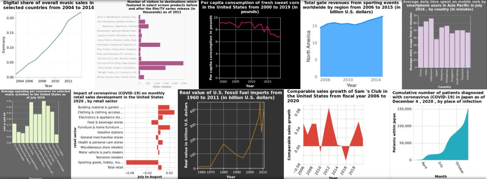

# VisText: A Benchmark for Semantically Rich Chart Captioning


VisText is a benchmark dataset of over 12,000 charts and semantically rich captions! In the VisText dataset, each chart is represented as its rasterized image, scene graph specification, and underlying datatable. Each chart is paired with a synthetic L1 caption that describes the chart's elemental and ecoded properties and a human-generated L2/L3 caption that describes trends and statistics about the chart.

In the VisText paper, we train text-based models (i.e, models that use the scene graph and data table chart representations) as well as image-guided models that include the chart image. We also include semantic prefix-tuning, allowing our models to customize the level of semantic content in the chat. Our models output verbose chart captions that contain varying levels of semantic content.

This repository contains code for training and evaluating the VisText models. For more info, see: [VisText: A Benchmark for Semantically Rich Chart Captioning (ACL 2023)](http://vis.csail.mit.edu/pubs/vistext)

## Repository Structure
```
run.sh # Main script used to train and evaluate models

./code # Dataset generation, training, and evaluation code
    image_guided/ # image-guided models use chart images
    text_only/ # text_only models use chart scene graphs and data tables
    ...
    
./data # Stores the VisText dataset
    feature_extraction/ # Code to extract chart visual features
    ...

./metrics # Default directory prediction metrics will be written to
    
./models # Stores model outputs and pretrained model checkpoints
```

## Set Up
### Clone the VisText repo

### Download the raw data
Call `download_data.sh` to download and unzip the raw data (and optional image-guided features and weights). By default, the tabular data files are downloaded (containing splits for the reduced scenegraphs, linearized data tables, and captions). Options are:
```
--images                 # Download rasterized image files
--scenegraphs            # Download original/hierarchical scene graph files
--image_guided           # Download visual features and the weights for VLT5/VLBart necessary for fine-tuning
```
To only download the splits for text-based captioning, run:
```
bash download_data.sh
```
To download all of the raw data run:
```
bash download_data.sh --images --scenegraphs
```

<!-- Download the raw data from the [dataset site](http://vis.csail.mit.edu/) and unzip to `data/`.
Ensure that you have three folders, `data/images`, `data/scenegraphs`, and `data/features`. -->

### Generate the VisText dataset from raw data
Run the `code/dataset_generation.ipynb` notebook from start to finish, which will generate the three split dataset files `data/data_train.json`, `data/data_test.json`, and `data/data_validation.json`.

<!-- ### Download pretained model checkpoints [image-guided only]
For image-guided models, we finetune the pretrained checkpoints from [VLT5](https://arxiv.org/abs/2102.02779). Download the `pretrain` folder from the [VLT5 Google Drive](https://drive.google.com/drive/folders/1wLdUVd0zYFsrF0LQvAUCy5TnTGDW48Fo?usp=share_link) and add it to the `models` folder. -->

## Usage
### Model training, evaluation, and predictions
Call `run.sh` with your desired parameters. Options are:
```
-c model_class           # Class of models to use ('text_only' or 'image_guided').
-b batch_size            # Batch size for training, validation, and testing.
-e num_epochs            # Number of epochs to train for.
-g num_gpus              # Number of gpus to parallelize across.
-i input_type            # Chart text representation ('scenegraph', 'datatable', or 'imageonly').
-m model_backbone        # Model architecture to finetune ('byt5', 't5', or 'bart').
-s seed                  # Seed number.
--prefix_tuning          # Flag to use sematic prefix tuning.
```
For example, to train and evaluate the `scene-graph` model with prefix tuning, run:
```
bash run.sh -c text_only -b 4 -e 50 -g 4 -i scenegraph -m byt5 -s 10 --prefix_tuning
```
### Evaluating on test set
Call `run_test.sh` with your parameters. Options are:
```
-p predictions_path      # Path of predictions
-f results_filename      # Filename to save results under in metrics/
--split_eval             # Flag to use for evaluating L1 and L2/L3 captions separately; only works with prefix tuning models.
--prefix_tuning          # Flag to use sematic prefix tuning.
```

For example, to run evaluation on the above trained model, run:
```
bash run_test.sh -p models/vistext_scenegraph_byt5_prefixtuningtrue_seed10/generated_predictions.txt -f vistext_scenegraph_byt5_prefixtuningtrue_seed10.txt --split_eval --prefix_tuning
```

## Citation
For more information about VisText, check out [VisText: A Benchmark for Semantically Rich Chart Captioning](http://vis.csail.mit.edu/pubs/vistext/)
```
@inproceedings{vistext,
  title={{VisText: A Benchmark for Semantically Rich Chart Captioning}},
  author={Tang, Benny J. and Boggust, Angie and Satyanarayan, Arvind},
  booktitle = {Annual Meeting of the Association for Computational Linguistics ({ACL})},
  year={2023}
}
```
